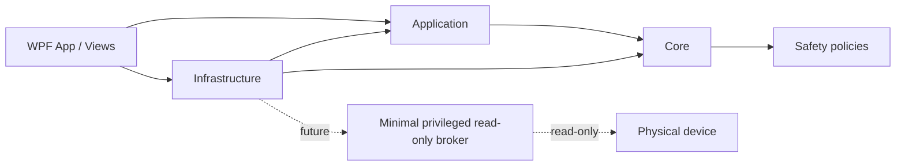
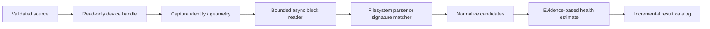

# Architecture

## Components and dependency rules

| Project | Responsibility | May depend on |
|---|---|---|
| `DataRecoveryStudio.Core` | Immutable domain records, enums, service contracts, validation and safety policies | BCL only |
| `DataRecoveryStudio.Application` | Use-case orchestration, navigation, commands, view models, filtering and presentation rules | Core |
| `DataRecoveryStudio.Infrastructure` | Mock device/scan/result adapters, JSON settings, localization, structured local logging; future Windows adapters | Application, Core |
| `DataRecoveryStudio.App` | WPF composition root, views, dialogs, themes, converters, UI-only behavior | Application, Core, Infrastructure |
| `DataRecoveryStudio.Tests` | Behavioral tests across non-UI boundaries | Core, Application, Infrastructure |

Core never references WPF, storage APIs, or infrastructure. Application code receives contracts through constructors. Infrastructure implements those contracts. The App composition root creates and connects implementations; this gives dependency injection without a service-locator or runtime container dependency.

## Main models and interfaces

Core models include `PhysicalDeviceId`, `StorageDevice`, `Volume`, `ScanMode`, `ScanSession`, `ScanProgress`, `RecoverableFile`, `FileCategory`, `RecoverabilityStatus`, `RecoveryRequest`, and `RecoveryResult`. Stable physical IDs are opaque value objects, never inferred solely from drive letters.

Key contracts are `IDeviceDiscoveryService`, `IScanService`, `IRecoveryCatalogService`, `ISettingsStore`, `ILocalizationService`, and `IStructuredLogger`. `RecoveryDestinationPolicy` is pure Core logic so every UI or future engine entry point can share the same rule.

## Navigation

`MainViewModel` owns one instance of each page view model and a `PageKind` state. Views are selected by WPF data templates. Child view models request transitions via narrow callbacks; they do not create windows or resolve services. Back navigation is explicit, and scan cancellation transitions into a canceled results state.

## Settings and localization

Settings are a versioned JSON document stored under `%LocalAppData%/DataRecoveryStudio/settings.json`, written atomically through a temporary file and replace/move. Invalid files fall back safely to defaults. `SettingsViewModel` applies theme/language changes immediately and persists them asynchronously.

Localization uses stable keys behind `ILocalizationService`, an English fallback dictionary, and a Vietnamese dictionary. The service raises a language-change notification so all bound primary navigation/page text refreshes without rebuilding view models. Additional cultures can be added without view changes.

## Planned scan pipeline

Standard scanners will use isolated NTFS/FAT/exFAT parsers. Deep scanners will consume the same read-only block abstraction and a documented signature registry. Neither receives a write-capable handle. Bounded channels provide backpressure and memory limits.

## Planned recovery pipeline

Validate request and physical identities → reserve a collision-safe destination → re-open the source read-only → read known extents or carved ranges → write only through a destination abstraction → optionally verify size/hash → atomically finalize the destination file → return per-file results. Failures leave explicit partial outcomes and cleanable temporary files only on the destination.

## Cancellation, progress, and errors

Every long operation accepts a `CancellationToken`. Cancellation is cooperative at bounded read/work intervals, closes handles in `finally`, and never converts canceled work to success. Progress uses immutable snapshots with phase, bytes, counts, elapsed time, and estimates; UI throttling will prevent dispatcher overload.

Expected media failures are typed, recoverable records associated with offsets. Bad sectors are retried under a bounded policy then skipped/reported. Device removal ends the active reader gracefully and preserves the current catalog. Unexpected exceptions are logged with event names and correlation/session IDs, converted to safe user messages at the application boundary, and never leak raw paths unnecessarily.

## Raw-device isolation and privilege

Phase 1 has no raw-device implementation. Future Windows access belongs in Infrastructure behind `IReadOnlyBlockDevice`, with safe handles and read-only access flags. If elevation is unavoidable, a minimal separately deployed broker will expose only allow-listed read operations over an authenticated local IPC channel. The WPF process and domain/application assemblies remain unprivileged and cannot call destructive disk-management APIs.
