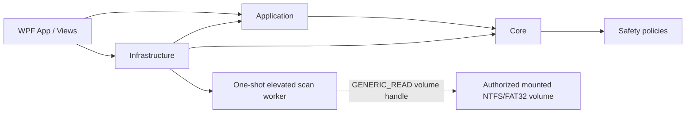

# Architecture

## Phase 7D validation boundary

Phase 7D leaves the UI, orchestration, and storage-engine boundaries separate. Core owns sanitized validation records and release-readiness evaluation. Application owns explicit Phase 3 snapshot resolution, one-time grant orchestration, monotonic/cancellation observation, and manual-removal identity matching. Infrastructure owns protocol validation, isolated worker lifecycle, read-only FAT32 evidence capture, abnormal-result suppression, and diagnostics-only JSON persistence.

The hardware harness calls the same worker client as the WPF workflow. It cannot open a live volume itself, substitute a mock after discovery, accept a physical-drive path, or authorize an undiscovered drive letter. Protocol 3 adds versioned FAT32 geometry, boot, selected-FAT, root-chain, lifecycle, and handle-disposal evidence without transmitting source bytes.

## Components and dependency rules

| Project | Responsibility | May depend on |
|---|---|---|
| `DataRecoveryStudio.Core` | Immutable domain records, enums, read-only scan/source and trusted-recovery contracts, validation and safety policies | BCL only |
| `DataRecoveryStudio.Application` | Use-case orchestration, trusted image-scan sessions and plans, navigation, commands, view models, filtering and presentation rules | Core |
| `DataRecoveryStudio.Infrastructure` | Windows metadata-only storage discovery, safe ordinary-file/in-memory byte sources, defensive NTFS parsing and image-only extraction, atomic destination writing, mock adapters, settings, localization, and logging | Application, Core |
| `DataRecoveryStudio.App` | WPF composition root, views, dialogs, themes, converters, UI-only behavior | Application, Core, Infrastructure |
| `DataRecoveryStudio.ScanWorker` | One-shot elevated Windows x64 host for authenticated, read-only live NTFS or FAT32 metadata scans | Core, Infrastructure |
| `DataRecoveryStudio.Tests` | Behavioral tests across non-UI boundaries | Core, Application, Infrastructure |

Core never references WPF, storage APIs, or infrastructure. Application code receives contracts through constructors. Infrastructure implements those contracts. The App composition root creates and connects implementations; this gives dependency injection without a service-locator or runtime container dependency.

## Main models and interfaces

Core models distinguish `PhysicalDisk` hardware metadata from scannable `Volume` filesystem metadata. A volume carries a set of physical identities because Windows volumes may span disks. Stable physical IDs are opaque, hashed value objects and are never inferred from drive letters or display labels.

## Phase 3 discovery flow

`WindowsStorageDiscoveryService` runs on a worker task behind `IDeviceDiscoveryService`. `WindowsStorageNative` exclusively owns the P/Invoke declarations and safe handles. Enumeration flows from volume GUID names to mount paths, filesystem/capacity metadata, disk extents, and optional per-disk storage descriptor/seek-penalty/geometry metadata. Pure parsers validate all byte counts, declared sizes, offsets, null terminators, extent counts, checked arithmetic, and bounded buffers before producing domain data.

Failures in optional physical metadata produce partial labels and session-only identities. A failure for one volume is logged by operation and Win32 code without serials and does not stop other volumes. A top-level enumeration failure is surfaced to the Devices page with Retry; mocks are never substituted.

Normal mode uses real discovery. `DATA_RECOVERY_STUDIO_DEVELOPMENT=1` selects the existing mock device provider explicitly. The WPF composition continues to use simulated scan and result services; Phase 4A's headless NTFS image scanner is not composed with a discovered volume.

WPF receives `WM_DEVICECHANGE`, debounces message bursts for 450 ms, and requests a cancellable refresh. Refresh generations prevent an obsolete result from replacing a newer list. Selected-volume removal invalidates Scan Options; removal during a simulated scan cancels that development session and clears its source/result context.

Key contracts are `IDeviceDiscoveryService`, `IScanService`, `IRecoveryCatalogService`, `ISettingsStore`, `ILocalizationService`, and `IStructuredLogger`. `RecoveryDestinationPolicy` is pure Core logic so every UI or future engine entry point can share the same rule.

## Navigation

`MainViewModel` owns one instance of each page view model and a `PageKind` state. Views are selected by WPF data templates. Child view models request transitions via narrow callbacks; they do not create windows or resolve services. Back navigation is explicit, and scan cancellation transitions into a canceled results state.

## Settings and localization

Settings are a versioned JSON document stored under `%LocalAppData%/DataRecoveryStudio/settings.json`, written atomically through a temporary file and replace/move. Invalid files fall back safely to defaults. `SettingsViewModel` applies theme/language changes immediately and persists them asynchronously.

Localization uses stable keys behind `ILocalizationService`, an English fallback dictionary, and a Vietnamese dictionary. The service raises a language-change notification so all bound primary navigation/page text refreshes without rebuilding view models. Additional cultures can be added without view changes.

## Scan pipeline foundation

The Phase 4B standard scanner uses isolated NTFS parsing behind `IReadOnlyRandomAccessSource`; no writable stream or native handle reaches it. It derives the MFT layout from record zero, traverses fragmented virtual extents, resolves bounded attribute-list extensions, reconstructs hard-link paths, and queries `$Bitmap` through a bounded cache. Phase 4C reuses that production parser for source/record/stream revalidation and streams supported image payload bytes to a separate validated destination. Phase 7A/7B use the same ordinary-file-only abstraction for FAT32 metadata and selected payload clusters; Phase 8A/8B extend the headless image services to conservative exFAT scanning and recovery.

## Phase 4C image-recovery pipeline

Completed image scan → retain opaque session/candidate provenance → build a no-run-list plan → validate destination → reopen the ordinary image read-only → rescan and re-resolve current NTFS metadata → stream supported resident/non-resident bytes through a create-new partial → flush and move without overwrite → hash the published file → return immutable per-file and batch outcomes. Failures and cancellation remove partial/unverified files; normal WPF routes cannot invoke this pipeline.

## Phase 7B FAT32 image-recovery pipeline

Completed Phase 7A image scan -> retain internal exact-slot provenance behind opaque session/candidate IDs -> build a cluster-free public plan -> validate the shared destination -> reopen and fingerprint the ordinary image read-only -> rerun production FAT32 metadata parsing -> build bounded active file/directory ownership -> derive a fresh zero-length, contiguous-free, preserved-chain, or explicitly damaged deterministic plan -> stream exact logical bytes through the shared create-new/atomic publication path -> reread selected source bytes and published output for SHA-256/length verification -> return immutable warning-aware outcomes. WPF and the live worker have no Phase 7B composition.

## Cancellation, progress, and errors

Every long operation accepts a `CancellationToken`. Cancellation is cooperative at bounded read/work intervals, closes handles in `finally`, and never converts canceled work to success. Progress uses immutable snapshots with phase, bytes, counts, elapsed time, and estimates; UI throttling will prevent dispatcher overload.

Expected media failures are typed, recoverable records associated with offsets. Bad sectors are retried under a bounded policy then skipped/reported. Device removal ends the active reader gracefully and preserves the current catalog. Unexpected exceptions are logged with event names and correlation/session IDs, converted to safe user messages at the application boundary, and never leak raw paths unnecessarily.

## Raw-device isolation and privilege

Phase 5A/7C isolate live volume access in a one-shot elevated worker. The parent grants only a current discovered eligible mounted NTFS or independently gated FAT32 volume, creates a random current-user-only named pipe, authenticates the worker with a per-session nonce, and accepts bounded normalized metadata only. Scanner kind and filesystem are bound end to end. The live handle is `GENERIC_READ`, share mode 7, `OPEN_EXISTING`, and overlapped; no physical-disk scan or arbitrary-offset command exists. WPF remains `asInvoker`, launches only after an enabled Standard Scan is explicitly started, and cannot invoke live recovery. See `phase-5a-live-ntfs-scan.md` and `phase-7c-live-fat32-standard-scan.md`.

## Phase 8A addition

The headless exFAT image service follows the existing project boundaries: immutable exFAT contracts in Core, session/consistency orchestration in Application, and source validation/binary parsing in Infrastructure. No App or ScanWorker composition changes are introduced. See [Phase 8A](phase-8a-exfat-image-metadata.md) for the supported metadata subset and internal future-recovery provenance. Phase 7D hardware validation remains deferred.

## Phase 8B addition

`ExFatRecoveryModels` defines immutable public ID-only requests and results. `ExFatImageScanService` also implements `IExFatImageRecoveryService`; its private registry creates single-use plans from completed owned sessions. `ExFatImageRecoveryEngine` refreshes the production `ExFatMetadataScanner` once per batch. An internal result seal binds fresh layouts to the actual parser result; no recovery parser or caller-supplied extents are introduced. Selected layouts are retained only during this refresh.

The engine stages exact initialized-byte copies plus logical zero tails, checks source consistency for the batch, then uses shared destination sanitation, collision handling, publication, and independent SHA-256 rereads. `RegularFileIdentity` binds held ordinary-file handles to Windows volume/file IDs; `RecoveryDirectoryLease` holds destination ancestors stable through publication and cleanup. Shared regular-file reads disable managed read-ahead. App/ScanWorker composition and live gates are unchanged. See [Phase 8B](phase-8b-exfat-image-recovery.md).

## Phase 8C live metadata integration

The existing live worker now routes an independently gated exFAT scanner kind directly to the production Phase 8A metadata parser. Core presentation DTOs omit recovery authority and payload; Application keeps grants, workflow and recovery lockout separate; Infrastructure owns bounded reads, metadata sampling and revalidation. Protocol v4 binds scanner kind throughout. Image services and Phase 8B destination/publication components remain outside live composition. See [Phase 8C](phase-8c-live-exfat-standard-scan.md). Phase 7D hardware validation remains deferred.
